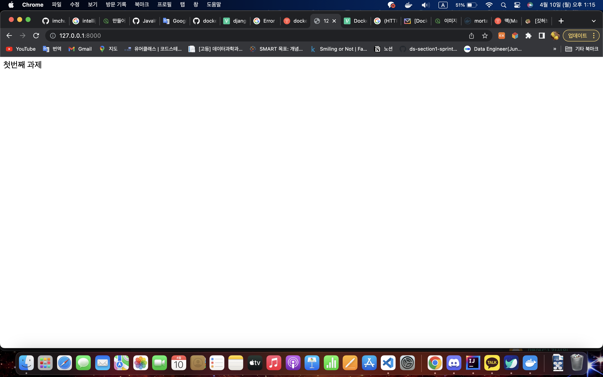

#실행

## 방법1

- Dockerfile로 이미지 빌드
  `docker build --tag mortalz/hello_django:latest .`
  

- 컨테이너 실행
  `docker run -p 8000:8000 -it mortalz/hello_django:latest`
  

## 방법2

- docker hub에서 이미지 받아오기
  `docker pull mortalz/hello_django:latest`

- 컨테이너 실행
  `docker run -p 8000:8000 -it mortalz/hello_django:latest`
  
