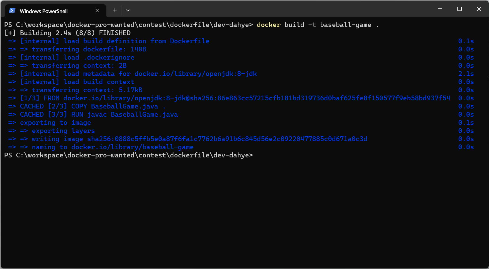
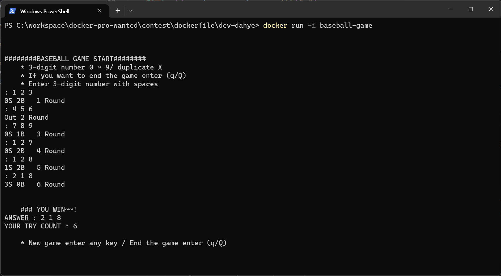

# 숫자 야구 게임
[숫자 야구 게임](https://namu.wiki/w/%EC%88%AB%EC%9E%90%EC%95%BC%EA%B5%AC)
- 중복되지 않는 0~9 숫자 3자리 입력받아 랜덤 숫자맞추기 
- 숫자는 맞지만 위치가 틀렸을 때는 볼.
- 숫자와 위치가 전부 맞으면 스트라이크.
- 숫자와 위치가 전부 틀리면 아웃.
  
## 실행
- Dockerfile로 이미지 빌드
```
docker build -t {tag-name} .
```

- 컨테이너 실행
```
docker run -i {tag-name}
```

