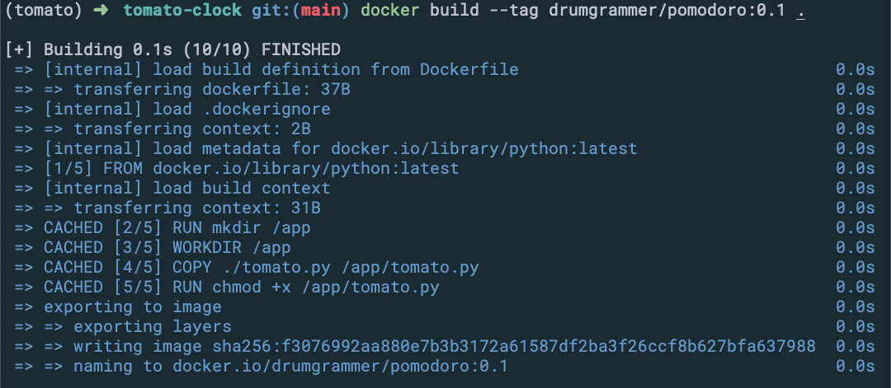
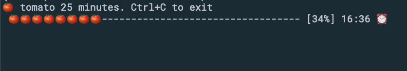

# 뽀모도로 기법이란
[뽀모도로 기법](https://ko.wikipedia.org/wiki/%ED%8F%AC%EB%AA%A8%EB%8F%84%EB%A1%9C_%EA%B8%B0%EB%B2%95)(Pomodoro Technique)은 시간 관리 방법론으로 1980년대 후반 '프란체스코 시릴로'(Francesco Cirillo)가 제안했다.

타이머를 이용해서 25분간 집중해서 일을 한 다음 5분간 휴식하는 방식이다. 

'뽀모도로'는 이탈리아어로 토마토를 뜻한다. 
프란체스코 시릴로가 대학생 시절 토마토 모양으로 생긴 요리용 타이머를 이용해 25분간 집중 후 휴식하는 일처리 방법을 제안한데서 그 이름이 유래했다.
(출처:위키백과)

뽀모도로 기법은 업무와 학습에 상당한 효율성을 제공한다.

## 코드 소스
tomato.py 소스 코드는 [🍅 Tomato Clock](https://github.com/coolcode/tomato-clock)에서 참조했다.

## 실행

### 방법 1
- Dockerfile로 이미지 빌드
```
docker build --tag {your-docker-hub-namespace}/pomodoro:latest .
```

- 컨테이너 실행
```
docker run -it {your-docker-hub-namespace}/pomodoro:latest
```

### 방법 2
- docker hub에서 이미지 받아오기
```
docker pull drumgrammer/pomodoro:latest
```
- 컨테이너 실행
```
docker run -it drumgrammer/pomodoro:latest
```

