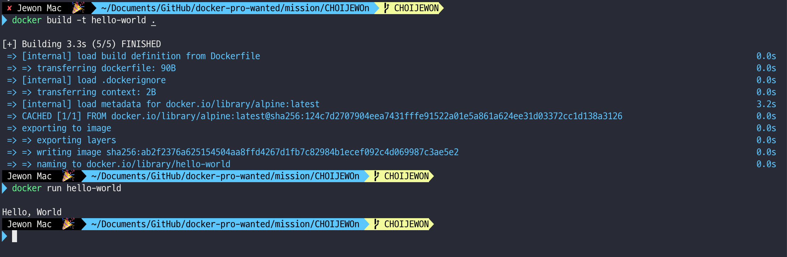

1. 컨테이너 기술이란 무엇입니까? (100자 이내로 요약)

```

컨테이너는 서버 운영 체제를 가상화하는 기술을 말합니다

즉 다양한 어플리케션을 설치해 하나의 서버처럼 사용할 수 있는 패키지입니다,

```

2. 도커란 무엇입니까? (100자 이내로 요약)

```

도커는 컨테이너 기반의 가상화 플랫폼입니다

컨테이너를 생성하거나, 관리하며, 컨테이너를 이미지로 만드는 작업등을 손쉽게 도와주는

컨테이너를 잘 다룰 수 있게 도와주는 도구입니다.

```

3. 도커 파일, 도커 이미지, 도커 컨테이너의 개념은 무엇이고, 서로 어떤 관계입니까?

```

- Doker file

도커 파일은 Docker 이미지를 빌드하기 위한 지침이 되는 파일입니다

애플리케이션을 실행하는데 필요한 환경과 종속성을 정의하며

애플리케이션을 Docker 이미지로 캡슐화하는 방법을 정의합니다

도커 파일은 도커 이미지를 빌드하기 위한 지침서의 역할입니다

- Docker image

도커 이미지는 소스코드, 런타임, 라이브러리등 소프트웨어를 실행하는데 필요한 모든 것을

포함하는 독립 실행형 패키지입니다

- Docker container

도커 컨테이너는 도커 이미지의 런타임 인스턴스입니다 모든 종속성과 더불어

앞서 컨테이너 기술에 기재했다 싶이 모든 종석성과 애플리케이션을 실행하는 '격리된' 인스턴스 입니다

특징으론 가벼우며 격리된 환경이기 때문에 운영체제 커널을 공유합니다

```

4. [실전 미션] 도커 설치하기


