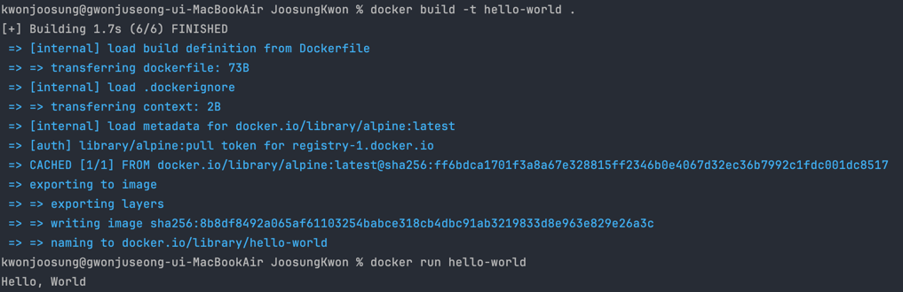

## 사전 미션
### 1. 컨테이너 기술이란 무엇입니까?

- 컨테이너 기술이란 OS를 논리적 분할하여 활용하는 가상화 기술 중 하나입니다.
  - 컨테이너는 어떤 환경에서나 소프트웨어 서비스를 실행하기 위한 필요한 모든 요소를 포함하는 경량 소프트웨어 패키지입니다.
  - 컨테이너는 호스트 운영체제와는 분리된 격리된 환경에서 독립적으로 실행하게 됩니다.

### 2. 도커란 무엇입니까?

- 도커란 컨테이너 기술을 기반으로 하는 오픈 소스 플랫폼입니다. 
  - 도커를 사용하면 애플리케이션을 쉽게 컨테이너로 패키징하고 배포할 수 있습니다.
  - 또한, 도커는 컨테이너를 실행하고 관리하는 데 필요한 기능들을 제공합니다.

### 3. 도커 파일, 도커 이미지, 도커 컨테이너의 개념은 무엇이고, 서로 어떤 관계일까?
- 도커 파일 : 도커 이미지를 빌드하기 위한 설정 파일입니다.
- 도커 이미지 : 도커 파일을 사용하여 빌드된 패키지입니다. 도커 이미지는 애플리케이션과 해당 종속성을 포함하는 완전히 독립된 파일 시스템입니다.
- 도커 컨테이너 : 도커 이미지의 실행 가능한 인스턴스입니다.
- 도커 파일을 빌드하면 이미지가 생성되고, 해당 이미지를 통해 도커 컨테이너를 생성 및 실행할 수 있다.
  - `도커 파일 -(빌드)-> 도커 이미지 -(생성)-> 도커 컨테이너`

### 4. [실전 미션] 도커 설치하기
 