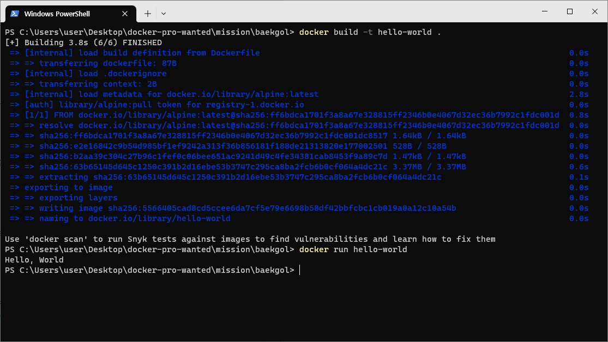

## 사전 미션
### 1. 컨테이너 기술이란 무엇입니까? (100자 이내로 요약)
컨테이너 기술이란 운영 중인 호스트의 시스템과는 별개로 공간을 분리하여 내부에서 또다른 시스템을 운영할 수 있는 기술이다.
컨테이너 기술을 이용하면 컨테이너별로 독립된 시스템 리소스를 사용할 수 있기 때문에 운영체제나 파일 시스템 등을 독자적으로 운영할 수 있다.

-----------------------------------------
### 2. 도커란 무엇입니까? (100자 이내로 요약)
도커란 컨테이너 기술을 기반으로 만들어진 가상화 플랫폼이다.
컨테이너를 손쉽게 생성하고 관리할 수 있도록 해주는 애플리케이션이라고 볼 수 있다.
마치 JVM과 같이 도커가 설치된 환경이라면 이미지를 통해 어디서든 서비스를 배포할 수 있다는 특징이 있다.

-----------------------------------------
### 3. 도커 파일, 도커 이미지, 도커 컨테이너의 개념은 무엇이고, 서로 어떤 관계일까?
도커 파일: 도커 이미지를 생성하기 위해 필요한 설정 파일이다. 컨테이너를 운영할 베이스 이미지, 생성 시 시작 명령어, 환경변수 등을 설정할 수 있다.
도커 이미지: 도커 파일에서 설정한 환경들이 저장된 압축된 형식의 개체이다. 도커 이미지 여러 레이어들로 구성되어 구동될 애플리케이션들의 정보를 불러올 수 있다.
도커 컨테이너: 도커 이미지를 통해 컨테이너를 생성할 수 있다. 컨테이너를 생성할 때 운영에 필요한 다양한 설정값을 입력할 수 있다.

-----------------------------------------
### 4. [실전 미션] 도커 설치하기

