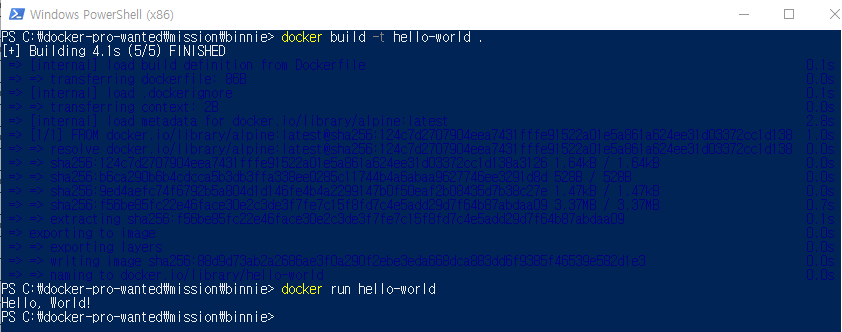

## 컨테이너 기술이란 무엇입니까? (100자 이내로 요약)
응용 프로그램을 실행하는 데 필요한 모든 라이브러리와 종속성을 포함하는 가상화된 환경을 만들어 애플리케이션 배포와 관리를 쉽게하는 기술 

## 도커란 무엇입니까? (100자 이내로 요약)
도커는 컨테이너 기술을 활용해 애플리케이션 실행에 필요한 환경을 빠르게 구축하고 배포할 수 있도록 도와주는 플랫폼

## 도커 파일, 도커 이미지, 도커 컨테이너의 개념은 무엇이고, 서로 어떤 관계입니까?
도커 파일은 도커 이미지를 생성하기 위한 스크립트 파일, 도커 이미지는 응용 프로그램과 해당 응용 프로그램이 실행될 때 필요한 모든 것을 포함하는 패키지, 도커  컨테이너는 도커 이미지를 실행하는 가상화 환경

도커 파일을 작성하여 도커 이미지를 만들고, 이 이미지를 기반으로 도커 컨테이너를 생성하여 실행

## [실전 미션] 도커 설치하기
