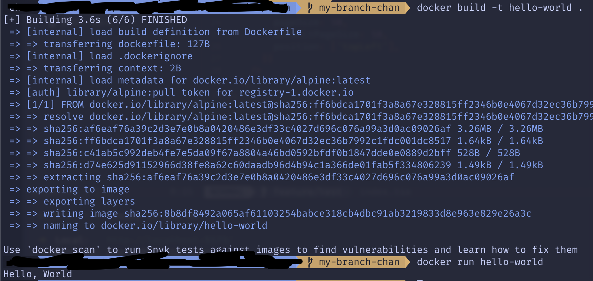

## 컨테이너 기술이란 무엇입니까?

논리적인 공간을 만들어 다양한 라이브러리 어플리케이을 설치해 하나의 서버처럼 사용할 수 있는 패키입니다

## 도커란 무엇인가

도커는 컨테이너 기술을 활용해 어플리케이션에 필요한 환경을 빠르게 구축하고 배포할 수 있도록 도와주는 플랫폼이다

## 도커 파일, 도커 이미지, 도커 컨테이너의 개념은 무엇이고, 서로 어떤 관계입니까?

도커 파일은 도커 이미지를 생성하기 위한 스크립트 파일입니다
도커 이미지의 경우 도커 컨테이너를 만들기 위한 템플릿이고
마지막으로 도커 컨테이너는 도커 이미지를 실행한 상태입니다

## 실전 과제

