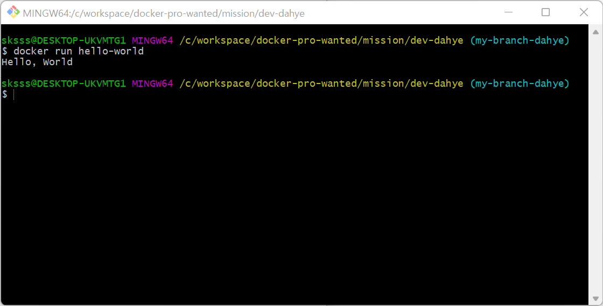

## 1. 컨테이너 기술이란 무엇입니까? (100자 이내로 요약)
컨테이너는 다른 PC나 서버 어디서든 실행될 수 있도록 애플리케이션 코드가 해당 라이브러리 및 종속 항목과 함께 패키징되어 있는 소프트웨어 실행 유닛이다.

호스트 OS에 접근해서 필요한 것들을 처리해주는 컨테이너 엔진(ex.도커)을 설치하여 개별적인 컨테이너를 만들어서 각각의 애플리케이션을 고립된 환경에서 구동한다.

## 도커란 무엇입니까? (100자 이내로 요약)
도커는 애플리케이션을 패키징할 수 있는 도구이다.
컨테이너 안에 애플리케이션과 그에 필요한 라이브러리, 환경설정등의 모든 dependencies를 하나로 묶어서 다른 PC와 서버에도 쉽게 배포하고 안정적으로 구동할 수 있도록 도와준다. 

## 도커 파일, 도커 이미지, 도커 컨테이너의 개념은 무엇이고, 서로 어떤 관계입니까?
1. 도커 파일
    마치 요리 레시피와 같이 애플리케이션을 구동하기 위해 필요한 것들을 기록한 파일. 도커 파일을 빌드하여 도커 이미지를 생성한다.
   * Copy files - 어플리케이션을 구동하기위해 필요한 파일이 무엇인지
   * Install dependencies - 어떤 프레임워크/ 라이브러리를 설치해야하는 지 (외부 디펜던시)
   * Set environment variables - 환경변수
   * Run setup scripts - 어떻게 구동해야하는 지 
 

2. 도커 이미지 
    애플리케이션 실행에 필요한 코드, 런타임 환경 ,시스템 툴, 시스템 라이브러리 등의 모든 세팅들을 포함한 어플리케이션의 현재 상태의 스냅샷이다.
    하나의 이미지는 여러 컨테이너를 생성할 수 있고, 컨테이너가 삭제되더라도 이미지는 변하지 않고 그대로 남아 있다.    
 

3. 도커 컨테이너
이미지(Image)를 실행한 상태로, 애플리케이션의 종속성과 함께 애플리케이션 자체를 패키징/캡슐화하여 격리된 공간에서 프로세스를 동작시키는 기술이다. 

## 실행한 화면을 캡쳐
{:width='50%'}