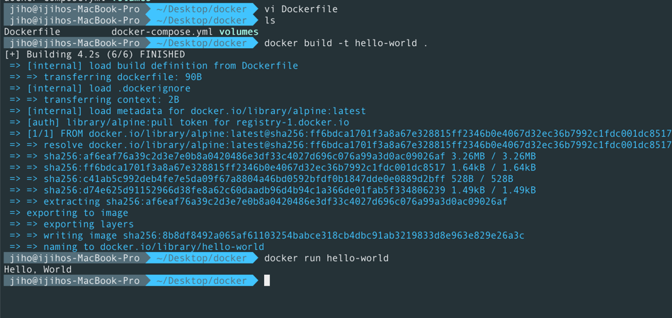

### 컨테이너 기술이란?
다양한 여러 어플리케이션을 단일 운영체제에서 **격리된 환경**으로 실행할 수 있게 해주는 경량 가상화 기술입니다.

### 도커란?
컨테이너 기술을 이용하여 여러 어플리케이션들을 실행하고 관리할 수 있게 하는 오픈소스 플랫폼입니다.

### 도커 파일, 도커 이미지, 도커 컨테이너의 개념은 무엇이고, 서로 어떤 관계입니까?
도커 파일: 도커 이미지를 생성하기 위한 모든 명령어가 포함된 텍스트 문서
도커 이미지: 도커 파일을 기반으로 빌드되어, 도커 컨테이너를 빌드할 때 사용되는 파일입니다.
도커 컨테이너: 도커 이미지를 기반으로 생성된 어플리케이션이 실행되는 단위로, 서로 격리되어 일관된 상태를 유지하게 합니다.

### 도커 설치하기

