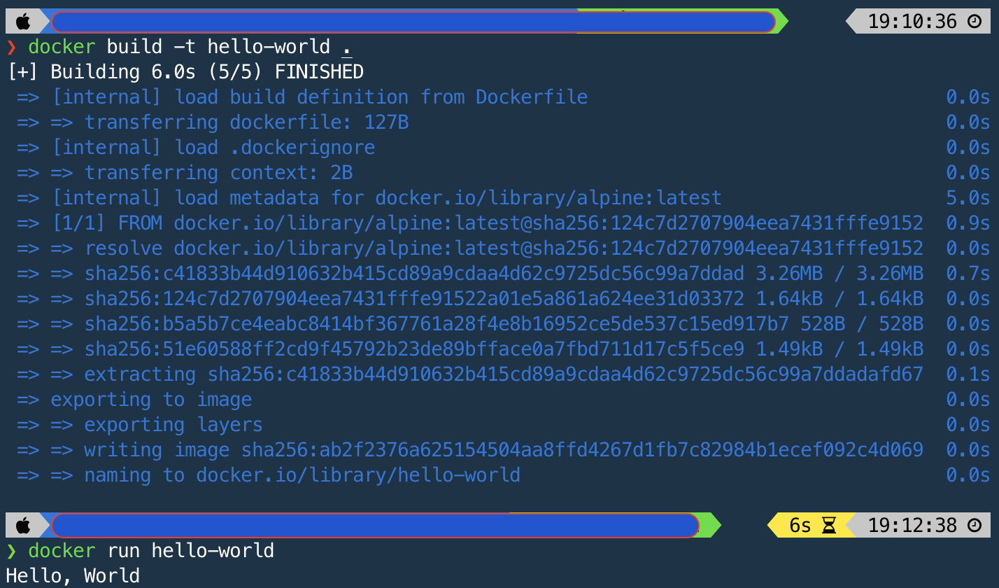

## 사전 미션

1. 컨테이너 기술이란 무엇입니까? (100자 이내로 요약)
    운영체제의 커널이 하나의 인스턴스가 아닌, 여러 개의 격리된 인스턴스들을 갖출 수 있도록 하는 서버 가상화 방식

    

2. 도커란 무엇입니까? (100자 이내로 요약)
    컨테이너 가상화 기술을 기반으로 하는 오픈 소스 플랫폼
    

3. 도커 파일, 도커 이미지, 도커 컨테이너의 개념은 무엇이고, 서로 어떤 관계입니까?
 (1) 도커 파일 : 이미지를 템플릿으로 비유한다면, 이 템플릿을 구성하는 요소를 결정하는 스크립트
 (2) 도커 이미지 : 컨테이너를 생성하기 위한 템플릿
 (3) 도커 컨테이너 : 이미지 실행 가능한 인스턴스
 (4) 관계 정리 : 도커파일에 따라 빌드된 이미지 안에 커스텀 애플리케이션 담아 놓고 컨테이너에 이미지를 실행

    
   도커파일에 따라 이미지 빌드(생성)하여 컨테이너에서 이미지 실행
 

4. [실전 미션] 도커 설치하기
    
