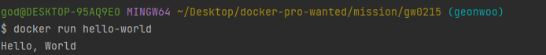

## 사전 미션

### 1. 컨테이너 기술이란 무엇입니까?

컨테이너는 소프트웨어를 격리하는 가상화 기술로
애플리케이션을 실행하는데 필요한 파일을 패키징하고,
격리된 환경에서 실행하여 다른 환경에서도 안정적으로 실행 가능하게 합니다.

### 2. 도커란 무엇입니까?
컨테이너 기술을 기반으로 하는 가상화 플랫폼입니다.
애플리케이션 환경을 도커 이미지로 만들어 컨테이너로 실행, 관리할 수 있게 해줍니다.

### 3. 도커 파일, 도커 이미지, 도커 컨테이너의 개념은 무엇이고, 서로 어떤 관계일까?
도커 파일 : 도커 이미지를 만들기 위한 설정 파일
도커 이미지 : 도커 파일 통해 마들어진 애플리케이션 실행을 위한 패키지
도커 컨테이너 : 해당 이미지의 인스턴스
도커 파일로 도커 이미지를 만들고 이미지로 도커 컨테이너를 만들어 실행할 수 있습니다.

### 4. [실전 미션] 도커 설치하기
