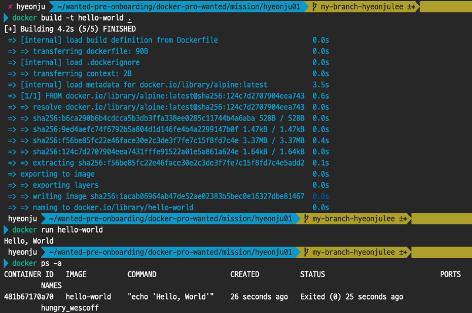

### 1. 컨테이너 기술이란 무엇입니까? (100자 이내로 요약)

컨테이너 기술이란 기존의 가상머신 기술과 달리, 호스트 OS 위에 별도의 가상 하드웨어를 만들지 않고도, 애플리케이션 작동에 필요한 실행환경을 하나의 컨테이너로 모아 마치 하나의 서버처럼 사용할 수 있는 기술이다.

---
### 2. 도커란 무엇입니까? (100자 이내로 요약)

도커는 오픈소스 플랫폼이다. 플랫폼에서 애플리케이션 실행에 필요한 환경을 '이미지'를 자유롭게 공유하며 사용할 수 있고, 이미지로 다양한 실행 환경에서도 정상 작동하는 '컨테이너'를 만들어 사용한다.   

---
### 3. 도커 파일, 도커 이미지, 도커 컨테이너의 개념은 무엇이고, 서로 어떤 관계입니까?
* **도커파일**이란 이미지 생성을 위해 작성하는 파일로, 이미지에 대한 정보를 기술해 둔 템플릿으로 생각할 수 있다. 
* **도커 이미지**란 서버 프로그램, 소스코드, 라이브러리, 컴파일된 실행 파일을 묶은 것이다. 
* **도커 컨테이너**는 도커 이미지를 실행한 상태로, 애플리케이션이 실행되고 있는 상태이다.

---
### 4. [실전 미션] 도커 설치하기 (참조: 도커 공식 설치 페이지)
