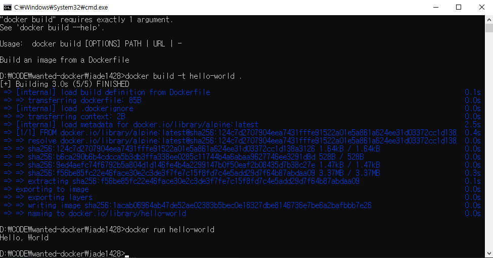

ans### 1. 컨테이너 기술이란 무엇입니까?
컨테이너란 가상화 기술의 일종으로, 베이스 환경의 OS를 공유하면서 필요한 프로세스와 해당 프로세스를 구동하는데 필요한 환경만을 격리하여 실행하는 기술이다.

### 2. 도커란 무엇입니까?
도커란 컨테이너 기반의 가상화 플랫폼으로, 이미지를 실행시켜 컨테이너로 만들거나 컨테이너를 실행시키거나 생성된 컨테이너를 관리하는 등의 작업을 할 수 있다.

### 3. 도커 파일, 도커 이미지, 도커 컨테이너의 개념은 무엇이고, 서로 어떤 관계입니까?
도커 파일은 도커에서 이미지를 생성하기 위해 만들어야 하는 파일이다. 도커 이미지는 도커 컨테이너를 만들기 위해 필요한 파일이며, 격리할 환경, 코드, 프로세스 등을 포함하는 템플릿이다. 도커 컨테이너란 격리된 가상 환경으로, 도커 이미지를 만들 때 포함시킨 환경이나 코드, 프로세스가 올라가 있다.

### 4. [실전 미션] 도커 설치하기

