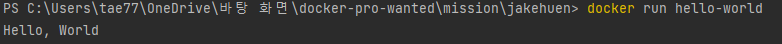

### 1. 컨테이너 기술이란 무엇입니까? (100자 이내로 요약)
컨테이너 기술이란 애플리케이션을 실행하기 위한 운영체제, 런타임, 라이브러리, 소스코드, 네트워크 모든 것을 포함하여 구성된다.
하나의 패키지로 묶어서 애플리케이션을 배포하고 실행하는 환경을 제공한다. 
호스트 운영체제와는 독립적으로 작동하여 이식성이 좋고, OS 설치 비용을 줄일 수 있어 가상화 기술보다 빠르다. 

### 2. 도커란 무엇입니까? (100자 이내로 요약)
컨테이너를 다루는 도구를 컨테이너 런타임 이라고 하는데, 컨테이너 런타임 중 제일 유명한 것이 도커이다. 
도커는 응용프로그램과 의존성을 컨테이너 단위로 묶어서 패키징하고, 컨테이너를 실행하는 환경을 제공한다.

### 3. 도커 파일, 도커 이미지, 도커 컨테이너의 개념은 무엇이고, 서로 어떤 관계입니까?
도커 파일은 text형태로 도커를 실행하는데 필요한 환경을 적는 파일이고, 해당 도커 파일을 빌드하면 도커이미지가 생성된다.
도커 이미지는 도커 컨테이너를 만들 때 사용된다. 도커 컨테이너는 도커 이미지를 기반으로 생성된 실행 가능한 인스턴스이다.

### 4. 도커 설치하기
