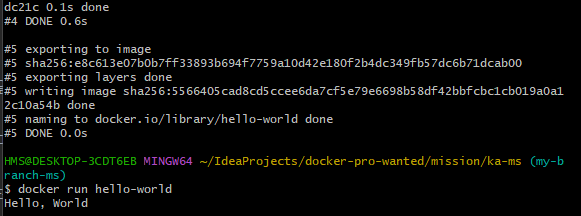

###  1. 컨테이너 기술이란 무엇입니까? (100자 이내로 요약)
컨테이너는 애플리케이션을 실행하기 위한 기술로, 애플리케이션의 실행 환경과 라이브러리, 의존성 등을 패키징하여 포함하는 가상화 기술입니다.
논리적인 공간을 만들어 다양한 어플리케이션을 설치해 하나의 서버처럼 사용할 수 있습니다.

### 2. 도커란 무엇입니까? (100자 이내로 요약)
도커는 컨테이너 기반 가상화 플랫폼입니다. 

### 3. 도커 파일, 도커 이미지, 도커 컨테이너의 개념은 무엇이고, 서로 어떤 관계입니까?
#### 3.1 도커 파일
도커 파일은 도커 이미지를 만들기 위한 설정파일 입니다. 어떤 어플리케이션을 실행할 것인지 어떤 환경에서 실행할 것인지, 어떤 라이브러리가 필요한지 등을 정의합니다. 도커파일은 일종의 레시피 같은것으로 이를 사용해 도커 이미지를 빌드 합니다.

#### 3.2 도커 이미지
도커 이미지는 도커 파일로 부터 빌드된 실행 가능한 파일입니다. 어플리케이션 실행에 필요한 모든 것을 포함하고 있기 때문에 호스트 운영체제와는 별도로 실행되며 도커 이미지를 이용하여 도커 컨테이너를 실행하고 생성합니다.

#### 3.3 도커 컨테이너
도커 컨테이너는 도커 이미지를 실행하는 가상 환경입니다. 도커 컨테이너는 도커 이미지를 이용하여 생성되고 호스트의 운영체제와는 별개로 실행되며 독립적인 파일과 시스템을 가지고 있습니다.

#### 3.4 그래서 서로 어떤관계?
즉, 도커 파일은 이미지를 빌드하기 위해 환경을 만드는 레시피-설정파일이라 할 수 있고, 도커 이미지는 어플리케이션 실행에 필요한 것들을 포함한 패키지이며, 도커 컨테이너는 도커 이미지를 이용하여 생성된 실행 가능한 가상 환경입니다.
도커 파일을 작성하여 이미지를 빌드하고 이를 이용해 도커 컨테이너를 생성하고 실행하는 것 입니다.

### 4. [실전미션] 도커 설치하기
