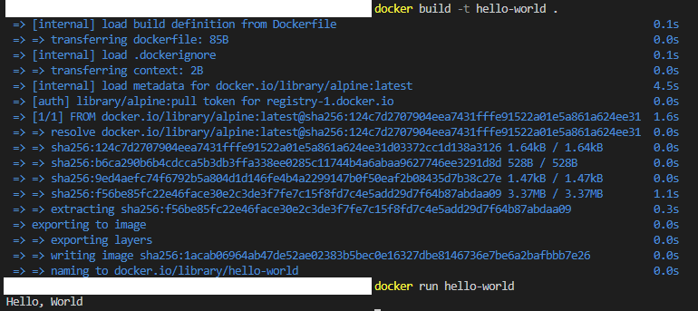

#### 1. 컨테이너 기술이란 무엇입니까? (100자 이내로 요약)
    - 애플리케이션을 실행하는 데 필요한 소프트웨어 및 구성 요소를 하나의 패키지로 묶어 격리된 환경에서 실행하는 기술
#### 2. 도커란 무엇입니까? (100자 이내로 요약)
    - 컨테이너 기반 가상화 기술을 이용하여 애플리케이션을 더 쉽고 효율적으로 개발, 배포, 운영할 수 있게 해주는 오픈소스 플랫폼    
#### 3. 도커 파일, 도커 이미지, 도커 컨테이너의 개념은 무엇이고, 서로 어떤 관계입니까?
    - 도커 파일은 도커 이미지를 생성하기 위한 빌드 스크립트
    - 도커 이미지는 애플리케이션을 실행하는 데 필요한 모든 소프트웨어 및 구성 요소를 포함하는 응용프로그램의 실행 가능한 패키지
    - 도커 컨테이너는 도커 이미지를 실행한 가상 환경
    관계:
    - 도커 파일을 통해 이미지를 생성하고, 이미지를 실행하여 컨테이너를 만든다

#### 4. 도커 설치하기
>    