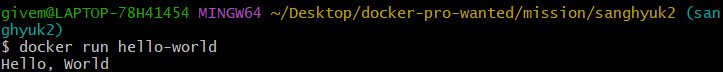

### 1. 컨테이너 기술이란 무엇입니까? (100자 이내로 요약)
- 컨테이너 기술이란 OS를 분할하여, 어플리케이션 실행에 필요한 라이브러리, 어플리케이션을 모아 별도의 서버인것처럼 사용할 수 있게 하는 기술입니다.
### 2. 도커란 무엇입니까? (100자 이내로 요약)
- 컨테이너 기술을 기반으로 한 가상화 플랫폼입니다. 별도의 독립적 환경을 설정하여 하드웨어를 효율적으로 활용하기 위한 오픈 소스 기술입니다. 
### 3. 도커 파일, 도커 이미지, 도커 컨테이너의 개념은 무엇이고, 서로 어떤 관계입니까?
- 도커 파일 : 도커 이미지를 만드는데 필요한 텍스트 파일입니다. 
- 도커 이미지 : 컨테이너 생성시 필요한 읽기 전용 템플릿(Read-Only-Template)입니다.
- 도커 컨테이너 : 도커 이미지로부터 생성된 배포된 인스턴스(Deployed Instances)입니다.
    - `도커 파일 -- (빌드) --> 도커 이미지 -- (생성) --> 도커 컨테이너`
### 4. [실전 미션] 도커 설치하기  
    