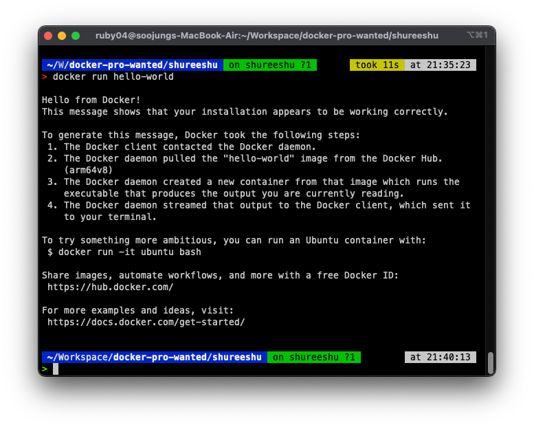

# docker-pro-wanted/mission/shureeshu

1. 컨테이너 기술이란 무엇입니까? (100자 이내로 요약)
    ```text
    컨테이너 기술은 애플리케이션을 실행하기 위한 기술로, 가상화 기술의 일종입니다.
    
    컨테이너는 격리된 환경에서 애플리케이션을 실행할 수 있도록 하는 기술입니다. 컨테이너를 사용하면 애플리케이션과 그 애플리케이션이 필요로 하는 라이브러리, 실행환경, 설정 등을 모두 패키징하여 포함할 수 있습니다. 이렇게 패키징된 애플리케이션은 다른 환경에서도 동일한 방식으로 실행될 수 있으므로, 환경에 의존적인 문제를 최소화할 수 있습니다.
    
    컨테이너 기술은 가상화 기술 중 하나이며, 하이퍼바이저 기반 가상화와 달리 게스트 OS를 실행하지 않고 호스트 OS 위에 애플리케이션을 직접 실행합니다. 이러한 이유로 컨테이너 기술은 가볍고 빠르게 애플리케이션을 배포하고 실행할 수 있으며, 클라우드 컴퓨팅, 마이크로서비스 아키텍처, CI/CD 등 다양한 분야에서 활용됩니다.
    
    대표적인 컨테이너 기술로는 Docker가 있으며, Kubernetes, Docker Swarm, Amazon ECS, Google Kubernetes Engine 등의 오케스트레이션 툴과 함께 사용됩니다.
    ```


1.  도커란 무엇입니까? (100자 이내로 요약)
    ```text
    Docker는 컨테이너 기술을 이용한 오픈 소스 가상화 플랫폼으로, 애플리케이션을 실행하기 위한 모든 환경을 패키징하여 컨테이너로 제공합니다. Docker 컨테이너는 격리된 환경에서 실행되기 때문에 호스트 OS와 상관없이 동일한 환경에서 일관성 있는 실행을 보장합니다.
    
    Docker를 사용하면 다음과 같은 장점을 얻을 수 있습니다.
    
    애플리케이션과 그에 필요한 모든 종속성(라이브러리, 설정, 실행 환경 등)을 컨테이너에 패키징하여 배포 및 실행할 수 있습니다.
    컨테이너의 격리 기술을 이용하여 애플리케이션의 실행 환경에 의존하지 않고, 환경 변수 등을 이용하여 설정 변경이 용이합니다.
    애플리케이션을 컨테이너 단위로 배포하여, 개발자와 운영팀간의 협업이 원활해지며, 배포 과정에서 발생하는 문제를 최소화할 수 있습니다.
    Docker는 개발자, 운영팀, 클라우드 환경에서 모두 사용되고 있으며, Kubernetes, Docker Swarm, Amazon ECS, Google Kubernetes Engine 등의 오케스트레이션 툴과 함께 사용됩니다.
    ```

1. 도커 파일, 도커 이미지, 도커 컨테이너의 개념은 무엇이고, 서로 어떤 관계입니까?
    ```text
    Docker 파일: Docker 파일은 Docker 이미지를 생성하기 위한 설정 파일로, Docker 이미지를 생성할 때 필요한 명령어와 파일 등을 정의합니다. Docker 파일은 일련의 명령어들이 작성된 텍스트 파일입니다.
    
    Docker 이미지: Docker 이미지는 Docker 파일을 바탕으로 빌드된 실행 가능한 패키지입니다. Docker 이미지는 애플리케이션을 실행하기 위한 모든 종속성(라이브러리, 설정, 실행 환경 등)을 포함합니다. Docker 이미지는 여러 개의 레이어(layer)로 구성되며, 각 레이어는 Docker 파일의 각 명령어들을 수행한 결과물입니다. 따라서, Docker 이미지는 변경 불가능한(immutable) 속성을 갖습니다.
    
    Docker 컨테이너: Docker 컨테이너는 Docker 이미지를 바탕으로 실행된 가상 환경입니다. Docker 컨테이너는 격리된 환경에서 실행되기 때문에 호스트 OS와 상관없이 동일한 환경에서 일관성 있는 실행을 보장합니다. Docker 컨테이너는 생성, 시작, 중지, 삭제 등의 생명주기(lifecycle)를 가집니다.
    
    즉, Docker 파일은 Docker 이미지를 생성하는데 사용되며, Docker 이미지는 애플리케이션을 실행하는데 필요한 모든 종속성을 포함한 실행 가능한 패키지입니다. Docker 컨테이너는 Docker 이미지를 실행한 가상 환경이며, 여러 개의 Docker 컨테이너가 하나의 Docker 이미지를 공유할 수 있습니다.
    ```

1. [실전 미션] 도커 설치하기 (참조: 도커 공식 설치 페이지)
    