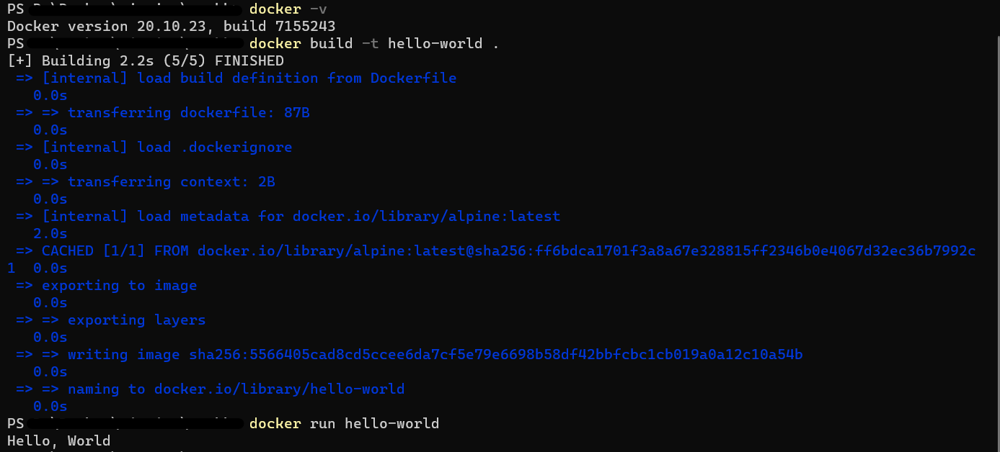

	
	1. 컨테이너 기술이란 무엇입니까? (100자 이내로 요약)
        - 소프트웨어를 실행하는 기술로 이를 위해 필요한 라이브러리와 같은 종속 항목과 어플리케이션 코드를 함께 포함하고, 실행의 독립성을 확보해주는 기술입니다.
    
    2. 도커란 무엇입니까? (100자 이내로 요약)
        - 도커는 컨테이너 기술을 이용하여 애플리케이션을 패키징하고 배포하는 플랫폼이며, 애플리케이션을 실행하는 환경을 컨테이너로 분리하여 호스트 운영체제와는 독립적인 실행 환경을 제공합니다.

    3. 도커 파일, 도커 이미지, 도커 컨테이너의 개념은 무엇이고, 서로 어떤 관계입니까?
        - 도커 파일은 도커 이미지를 생성하기 위한 스크립트 파일입니다. 
        - 도커 이미지는 컨테이너를 실행하는 데 필요한 파일, 응용 프로그램 및 설정 등의 모든 것을 포함하는 것으로 더이상의 의존성 파일을 컴파일하거나 설치 할 필요없는 상태의 파일을 말합니다. 
        - 도커 컨테이너는 도커 이미지를 실행한 상태로, 응용프로그램의 종속성과 함께 프로그램 자체를 패키징하여 격리된 공간에서 프로세스를 실행시키는 기술입니다. 
        - 즉, 도커 파일은 도커 이미지를 빌드하는데 사용되며, 도커 이미지는 애플리케이션 실행을 위한 빌드 단계에서 생성되고, 이를 기반으로 컨테이너를 생성하여 애플리케이션을 실행합니다.

    4. 도커 설치하기
        