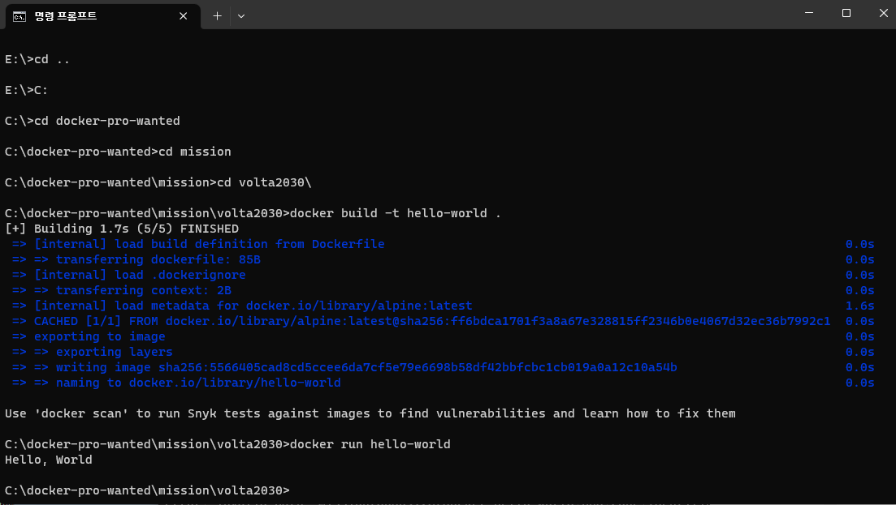

1. 컨테이너 기술이란 무엇입니까? (100자 이내로 요약)
   
- 우선적으로 컨테이너란 어디에서나 애플리케이션을 실행하기 위해 필요한 모든 요소가 포함되어 있는 소프트웨어 패키지 입니다.
- 컨테이너 기술이란 소프트웨어 실행 환경을 가상화 하는 기술로, 가상머신보다 더 가볍고 빠릅니다.
- 기존의 가상화 기술은 하나의 호스트 운영체제에서 여러개의 게스트 운영체제를 실행하는 방식으로 동작하지만, 컨테이너 기술은 호스트 운영체제의 리소스와 커널을 공유함으로서 가볍고 빠른 실행 환경을 제공 할 수 있습니다.

---

2. 도커란 무엇입니까? (100자 이내로 요약)

- 도커는 컨테이너 기반의 오픈소스 가상화 플랫폼 입니다. 도커를 사용하는 목적은 실행환경에서 컨테이너를 만들면서 프로그램의 배포 및 관리의 단순화입니다.
- 도커 컨테이너는 별도의 운영체제를 요구하거나 포함하지 않습니다. 커널 기존에 의존하여 리소스를 격리합니다.

---

3. 도커 파일, 도커 이미지, 도커 컨테이너의 개념은 무엇이고, 서로 어떤 관계일까?

- Docker File : 도커에서 이미지를 생성하기 위한 용도로 작성되는 파일입니다.
- Docker Image : 도커 파일을 빌드하여 생성된, 실행가능한 패키지 입니다. 도커에서 특정 프로세스를 실행하기 위한 모든 설정값을 가지고 있습니다.
- Docker Container : 사용자가 기본 시스템에서 애플리케이션을 분리할 수 있는 가상화된 런타임 환경입니다.

- 도커 파일을 빌드하여 도커 이미지를 생성하고, 도커 이미지를 기반으로 생성된 가상 환경이 도커 컨테이너가 됩니다.

---

4. [실전 미션] 도커 설치하기 (참조: [도커 공식 설치 페이지](https://docs.docker.com/engine/install/))
- 아래 `도커 설치부터 실행 튜토리얼`을 참조하여 도커를 설치하고, 도커 컨테이너를 실행한 화면을 캡쳐해서 Pull Request에 올리세요.
