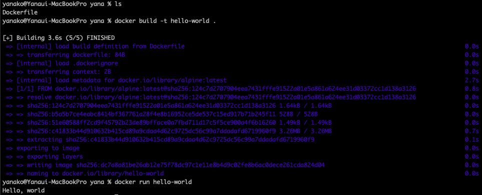

# 사전 미션

## 1. 컨테이너 기술이란 무엇입니까? (100자 이내로 요약)

```
컨테이너는 운영 체제 가상화의 한 형태.
기존 VM과의 차이점으로는 VM의 경우 내부에 또 다른 운영체제를 Full로 설치하여 그 위에서 가상의 컴퓨터를 가동하지만,
컨테이너 기술은 HOST의 운영체제를 활용하며, 도커의 경우 Host OS와 비교해서 다른부분만 Packing해 사용함.

```

## 2. 도커란 무엇입니까? (100자 이내로 요약)

```
컨테이너 기반의 오픈소스 가상화 플렛폼. 리눅스 커널의 cgroups와 namespaces 기능을 활용해, 전가상화, 반가상화보다
빠른속도로 Host OS 이용, 다양한 환경( 클라우드, 온프레미스 등)에 적용 가능.
- 하나의 서버에 여러개의 프로그램을 설치
- 여러개의 라이브러리의 버전이 다르거나 동일한 포트를 사용하는 경우
- 서버 환경을 바꿔야하는 상황이 발생할때 유용.
```

## 3. 도커 파일, 도커 이미지, 도커 컨테이너의 개념은 무엇이고, 서로 어떤 관계 입니까?

```
1) File : docker 에서 이미지를 생성하기 위한 용도로 작성하는 파일. 즉, 만들 이미지에 대한 정보를 기술해 둔 템플릿이라고 보면 됨.
   - FROM : Base image를 지정
   - RUN : command 를 실행해 새 이미지에 포함시키는 역할
   - CMD : 컨테이너가 시작될 때 실행할 커맨드 지정(이미 만들어진 이미지로부터 도커 컨테이너를 시작할 때 실행)
   - ENTRYPOINT : 컨테이너 시작 시 실행될 command 를 지정(CMD와 달리 컨테이너 실행 시 param 값을 대체할 수 없음)
   - LABEL : key-value 형식으로 작성된 메타데이터를 이미지에 추가
   - key-value 형식으로 작성된 메타데이터를 이미지에 추가
   - ENV : 환경변수 추가
   - EXPOSE : 컨테이너로 들어오는 트래픽을 특정 포트(port) 로 받아들일 수 있도록(listen) 지정
   - COPY : Host 내에 있는 파일 또는 디렉토리를 컨테이너의 파일시스템으로 복사
   - USER : 컨테이너 안에서 명령을 실행할 유저명, 유저그룹을 설정
   - WORKDIR : 작업 디렉토리(Working Directory) 를 설정
   - VOLUME : 컨테이너 내의 특정 디렉토리를 컨테이너 외부 경로에 마운트(mount) 시켜주는 지시자
      
2) Images : 도커에서 서비스 운영에 필요한 서버 프로그램, 소스코드 및 라이브러리, 컴파일된 실행 파일을 묶는 형태.
   즉, 소스 코드, 라이브러리, 종속성, 도구 및 응용 프로그램을 실행하는데 필요한 기타 파일을 포함하는 불변(변경 불가) 파일.
   
3) Container : 사용자가 기본 시스템에서 애플리케이션을 분리할 수 있는 가상화된 런타임 환경.
   즉, 컨테이너는 응용프로그램을 빠르고 쉽게 시작할 수 있는 portable units임.
```

## 4. [실전 미션] 도커 설치하기

