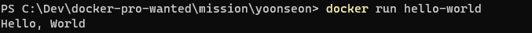

### 1. 컨테이너 기술이란 무엇입니까? (100자 이내로 요약)
어플리케이션을 작동시키기 위해 필요한 라이브러리나 어플리케이션 등을 하나로 모아 마치 별도의 서버인 것처럼 사용할 수 있게 해주는 기술
### 2. 도커란 무엇입니까? (100자 이내로 요약)
도커란 컨테이너 기술을 기반으로한 가상화 플랫폼으로 어플리케이션 개발 중 종속성으로 인해 생기는 문제를 해결해줌으로 인해 배포와 확장을 용이하게 한다.
### 3. 도커 파일, 도커 이미지, 도커 컨테이너의 개념은 무엇이고, 서로 어떤 관계입니까?
1. 도커파일
- 도커에서 이미지를 생성하기 위한 용도로 작성되는 파일. 즉, 만들 이미지에 대한 정보를 기술해둔 템플릿이다.
2. 도커 이미지
- 도커에서 서비스 운영에 필요한 서버 프로그램, 소스코드 및 라이브러리, 컴파일된 실행 파일을 묶는 형태. 변경이 불가능하다.
3. 도커 컨테이너
- 이미지를 실행한 상태로, 응용프로그램의 종속성과 함께 응용프로그램 자체를 패키징 or 캡슐화하여 격리된 공간에서 프로세스를 동작시키는 기술
### 4. [실전 미션] 도커 설치하기 (참조: 도커 공식 설치 페이지)
